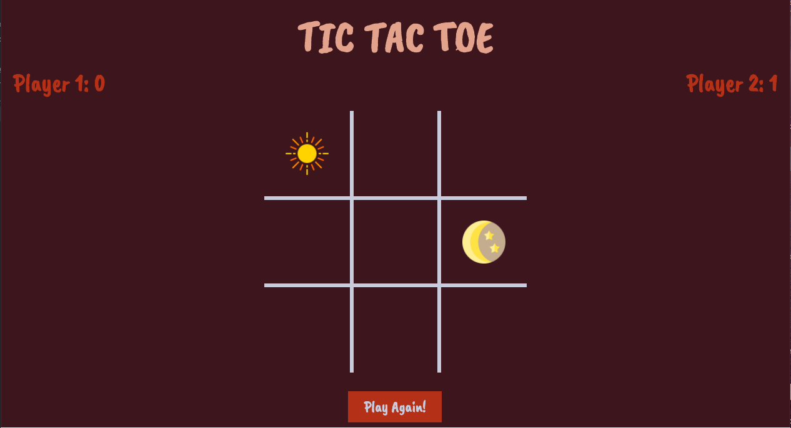

<!-- understand paragraph by default. -->
# Project#0 - Tic Tac Toe

<!-- anchor tag -->
Have a try [here](https://anchorite1001.github.io/project0/). Comments and suggestions are welcome!

<!-- img tag:  -->


<!-- bullet point list + word styling -->
## Overview
* **Tic Tac Toe**: 3x3 gameboard & 2 players
* Html + CSS + Javascript
* First project in General Assembly *Software Engineering Immersive*
<!-- documentations that need coding present:
```coding language(e.g. javascript)
coding in between
```
or just refering a little bit of coding / name of a variable: `window` -->
## Acknowledgements
* I found the cute sun & moon tokens on [freepik](https://www.freepik.com/).
* All fonts in the game are from [Google fonts](https://fonts.google.com/).
* I made the color palette of this game on [Coolors](https://coolors.co/).
